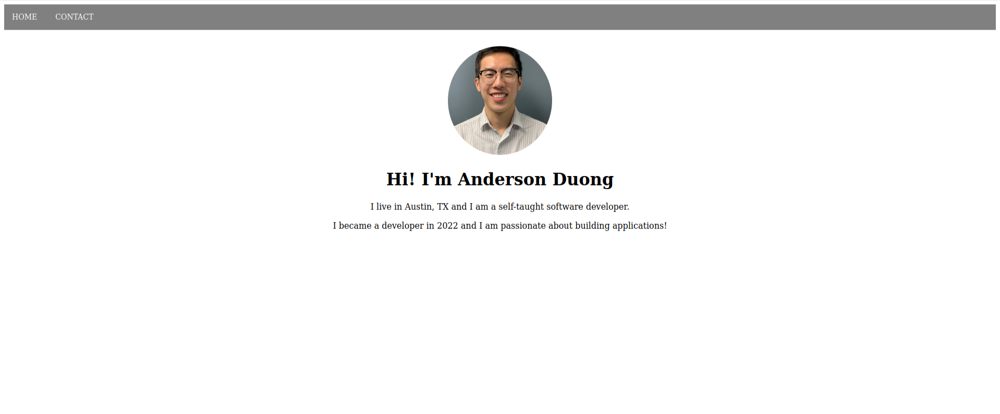

## simple-personal-website

This project provided a simplified version of a personal website using only HTML and CSS.

[Live Demo](duongand.github.io/)

### Summary
This project provided a primer in using only HTML and CSS to create a simple website with basic information of the developer. The project also helps learn the basic of git to stage, commit, and push files to Github to deploy on Github Pages.

### Author
* **Anderson Duong** - Self-Teaching Programmer